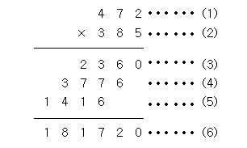

# [Bronze Ⅴ] 곱셈 - 2588

|시간 제한|메모리 제한|
|---|---|
|1 초|128 MB|

 

### 문제
(세 자리 수) × (세 자리 수)는 다음과 같은 과정을 통하여 이루어진다.

(1)과 (2)위치에 들어갈 세 자리 자연수가 주어질 때 (3), (4), (5), (6)위치에 들어갈 값을 구하는 프로그램을 작성하시오.

 

### 입력
첫째 줄에 (1)의 위치에 들어갈 세 자리 자연수가, 둘째 줄에 (2)의 위치에 들어갈 세자리 자연수가 주어진다.

 

### 출력
첫째 줄부터 넷째 줄까지 차례대로 (3), (4), (5), (6)에 들어갈 값을 출력한다.

 

|예제 입력|예제 출력|
|---|---|
|472 385|2360 3776 1416 181720|

 

### 알고리즘 분류
* 수학
* 사칙연산

 

---
**[출처]** > 백준 > 문제 > 단계별로 풀어보기 > 입출력과 사칙연산 > [곱셈](https://www.acmicpc.net/problem/2588)